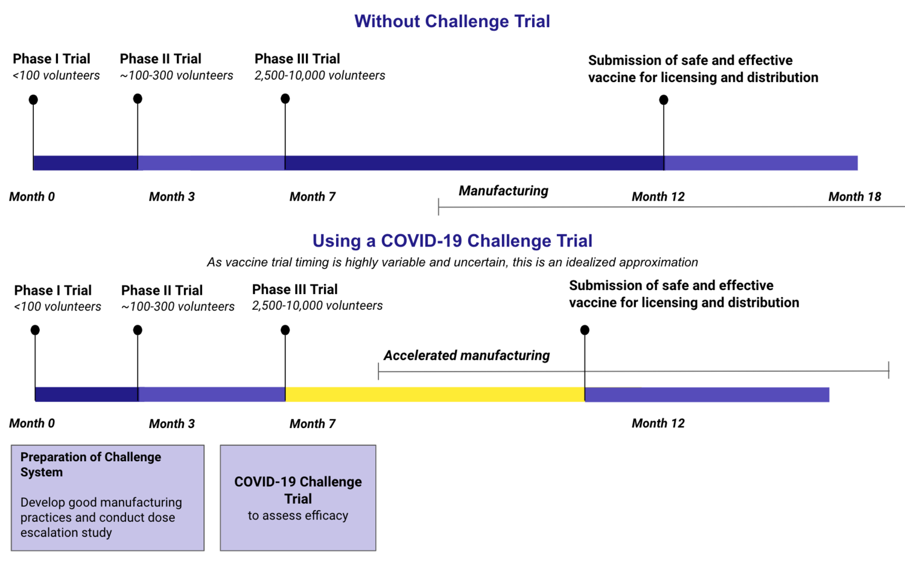

**'Human Challenge Trials' könnten die Entwicklung von Impfstoffen gegen den Corona Virus beschleunigen.
Dabei werden, denen ein experimenteller Impfstoff verabreicht wurde, bewusst dem Virus ausgesetzt, um testen, ob sie eine Immunität aufgebaut haben.**

**Aus ethischen Gründen, ist dies normalerweise nicht vorgesehen.
Ich (und auch führende Wissenschafter [@eyal]) denken aber, dass es aber in dieser Situation durchaus sinnvoll ist.**

### Wie Menschenversuche helfen, die Entwicklung eines Impfstoffen zu beschleunigen.

Gewöhnlich kann es Jahre dauern, bis ein Impfstoff Genehmigt wird.
Dabei ist es nicht die eigentliche Suche nach dem neuen Impfstoff, die diesen Prozess so langwierig macht, sondern die Menschenversuche.
Dabei wird der Impfstoff in 3 Phasen immer mehr Personen Verabreicht.
In Phase 3 werden mehreren tausen Personen geimpft.
Um dann zu zeigen, dass der Impfstoff effektiv ist, wird mehrere Monate gewartet, und die Infektionsraten unter den geimpften mit einer Kontrollgruppe zu vergleichen.
Die kann aber mehrere Monate dauern, und mit den derzeitigen social-distancing Maßnahmen, kann es sehr lange dauern, bis diese Versuche ein statistisch signifikantes Ergebnis liefern. 

Vor allem diese Phase der Impfstoffentwicklung kann durch eine 'Human Challenge' beschleunigt werden.
Sie könnten etwa Parallel zu Phase 3 durchgeführt werden, und wichtige zusätzliche Daten liefern.

### Vorteile
Die möglichen Vorteile liegen auf der Hand.
Jeder tag

### Wie kann ich mich melden?
Derzeit gibt es keine möglichkeit, sich freiwillig zu melden.
Man kann sich zwar auf [1dayooner](https://1daysooner.org/volunteer) eintragen, die 

### Wieso ich mich zu Wort melde?
Obwohl ich kein Mediziner/Immunuloge/Virologe bin, habe ich mich dazu entschieden, diese Entscheidung öffentlich zu machen.
Wissenschafter und Politiker sind verständlicherweise zurückhaltend zu verlangen, dass sich Menschen freiwillig für derartige Tests zur verfügung stellen - die gefahr eines Backlashes ist viel zu groß.
Ich, als 25 Jähriger, weitgehend gesunder Mensch, der bereit ist, ein derartiges Risiko einzugehen, bin daher in einer besonderen Situation, diese Diskussion in Gang zu bringen.

### Verbindung zu 1daysooner.org
Derzeit besteht keine formale Beziehung zu [1daysooner.org](https://1daysooner.org).
Die Seite diente bloß als Inspiration und Referenz.

